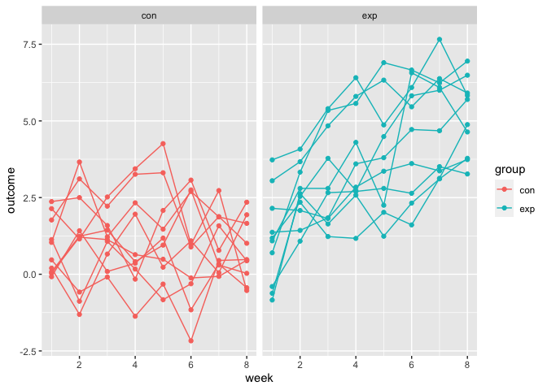

Data Science Homework 5
================
Thirsten Stockton
November 16th, 2022

## Problem 1

Loading data set

``` r
exp_df = 
  tibble(
    files = list.files("./data/zip_data/data/"),
    path = str_c("./data/zip_data/data/", files)) %>% 
  mutate(data = purrr::map(path, read_csv)) %>% 
  unnest()

exp_df
```

    ## # A tibble: 20 × 10
    ##    files      path       week_1 week_2 week_3 week_4 week_5 week_6 week_7 week_8
    ##    <chr>      <chr>       <dbl>  <dbl>  <dbl>  <dbl>  <dbl>  <dbl>  <dbl>  <dbl>
    ##  1 con_01.csv ./data/zi…   0.2   -1.31   0.66   1.96   0.23   1.09   0.05   1.94
    ##  2 con_02.csv ./data/zi…   1.13  -0.88   1.07   0.17  -0.83  -0.31   1.58   0.44
    ##  3 con_03.csv ./data/zi…   1.77   3.11   2.22   3.26   3.31   0.89   1.88   1.01
    ##  4 con_04.csv ./data/zi…   1.04   3.66   1.22   2.33   1.47   2.7    1.87   1.66
    ##  5 con_05.csv ./data/zi…   0.47  -0.58  -0.09  -1.37  -0.32  -2.17   0.45   0.48
    ##  6 con_06.csv ./data/zi…   2.37   2.5    1.59  -0.16   2.08   3.07   0.78   2.35
    ##  7 con_07.csv ./data/zi…   0.03   1.21   1.13   0.64   0.49  -0.12  -0.07   0.46
    ##  8 con_08.csv ./data/zi…  -0.08   1.42   0.09   0.36   1.18  -1.16   0.33  -0.44
    ##  9 con_09.csv ./data/zi…   0.08   1.24   1.44   0.41   0.95   2.75   0.3    0.03
    ## 10 con_10.csv ./data/zi…   2.14   1.15   2.52   3.44   4.26   0.97   2.73  -0.53
    ## 11 exp_01.csv ./data/zi…   3.05   3.67   4.84   5.8    6.33   5.46   6.38   5.91
    ## 12 exp_02.csv ./data/zi…  -0.84   2.63   1.64   2.58   1.24   2.32   3.11   3.78
    ## 13 exp_03.csv ./data/zi…   2.15   2.08   1.82   2.84   3.36   3.61   3.37   3.74
    ## 14 exp_04.csv ./data/zi…  -0.62   2.54   3.78   2.73   4.49   5.82   6      6.49
    ## 15 exp_05.csv ./data/zi…   0.7    3.33   5.34   5.57   6.9    6.66   6.24   6.95
    ## 16 exp_06.csv ./data/zi…   3.73   4.08   5.4    6.41   4.87   6.09   7.66   5.83
    ## 17 exp_07.csv ./data/zi…   1.18   2.35   1.23   1.17   2.02   1.61   3.13   4.88
    ## 18 exp_08.csv ./data/zi…   1.37   1.43   1.84   3.6    3.8    4.72   4.68   5.7 
    ## 19 exp_09.csv ./data/zi…  -0.4    1.08   2.66   2.7    2.8    2.64   3.51   3.27
    ## 20 exp_10.csv ./data/zi…   1.09   2.8    2.8    4.3    2.25   6.57   6.09   4.64

## Tidying data set

``` r
exp_tidy_df = 
  exp_df %>% 
  mutate(
    files = str_replace(files, ".csv", ""),
    group = str_sub(files, 1, 3)) %>% 
  pivot_longer(
    week_1:week_8,
    names_to = "week",
    values_to = "outcome",
    names_prefix = "week_") %>% 
  mutate(week = as.numeric(week)) %>% 
  select(group, subj = files, week, outcome)

exp_tidy_df
```

    ## # A tibble: 160 × 4
    ##   group subj    week outcome
    ##   <chr> <chr>  <dbl>   <dbl>
    ## 1 con   con_01     1    0.2 
    ## 2 con   con_01     2   -1.31
    ## 3 con   con_01     3    0.66
    ## 4 con   con_01     4    1.96
    ## 5 con   con_01     5    0.23
    ## # … with 155 more rows
    ## # ℹ Use `print(n = ...)` to see more rows

## Spaghetti plot showing observations on each subject over time

``` r
exp_tidy_df %>% 
  ggplot(aes(x = week, y = outcome, group = subj, color = group)) + 
    geom_point() + 
      geom_path() + 
        facet_grid(~group)
```

<!-- -->

Looking at this spaghetti plot, you see that for those in the control
arm, the outcome stays relatively stable during the duration of follow
up time, while for those in the experimental arm, the outcome increases.
